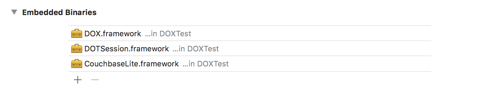

# SDK Implementation guide(iOS) 


## SDK 적용 방법

### 1. SDK 설치하기
제공되는 3개의 framework 파일을 아래와 같이 추가합니다.

TARGETS - General - Embedded Binaries

<br/>

<!--프로젝트 네이게이터에서 아래와 같은 상태를 확인할 수 있습니다.

-->

### 2. Key 등록
XCode 프로젝트의 info.plist 파일에 제공받은 App Analytics Key 정보를 추가합니다
info.plist 파일을 open할때 'Property list'가 아니라 'Source Code'로 open한 후, 제공받으신 Key를 Ctrl+V 하면 됩니다.
제공받은 Key값은 아래의 예시와 같이 xml 형태를 가지고 있는 데이터 입니다.

```xml
<key>dotAuthorizationKey</key>
<dict>
		<key>domain_x</key>
		<string>http://report.wisetracker.co.kr/gsshop.html</string>
		<key>useMode</key>
		<integer>3</integer>
		<key>accessToken</key>
		<string></string>
		<key>expireDate</key>
		<string>14</string>
		<key>isDebug</key>
		<string>true</string>
		<key>isFingerPrint</key>
		<string>true</string>
		<key>isInstallRetention</key>
		<string>true</string>
		<key>serviceNumber</key>
		<string>103</string>
</dict>
```

http통신을 허용하기 위해 NSAppTransportSecurity 를 아래와 같이 추가합니다.

```xml
<key>NSAppTransportSecurity</key>
<dict>
    <key>NSAllowsArbitraryLoads</key>
    <true/>
</dict>
```

### 3. SDK initialization
XCode 프로젝트의 AppDelegate 가 정의된 클래스의 **didFinishLaunchingWithOptions ** 함수에 SDK를 Initialization하기 위한 코드를 다음과 같이 적용합니다

#### - Swfit
```Swift
import DOX
func application(_ application: UIApplication, didFinishLaunchingWithOptions launchOptions: [UIApplication.LaunchOptionsKey: Any]?) -> Bool {
      
        DOX.initialization()
        return true
    }
```
 
#### - Objective-C   
```Objective-c
#import <DOX/DOX.h>
- (BOOL)application:(UIApplication *)application didFinishLaunchingWithOptions:(NSDictionary *)launchOptions {
    [DOX initialization];
    
    return true;
}
```

DOX가 사용되는 곳에서는 Swift, Objecitve-C에서 각각 import DOX, #import <DOX/DOX.h>을 통해 import가 필요합니다. 
이하 적용 예시에서는 가독성을 위해 import하는 부분이 생략되어 있습니다.

## 유입경로 분석

### 외부 유입 경로 분석(DeepLink)
앱이 설치된 이후 DeepLink를 통해서 앱이 실행되는 경로 분석이 필요한 경우 아래와 같이 setDeepLink() 함수를 사용하면 분석이 가능합니다.

#### - Swift
```Swift
func application(_ app: UIApplication, open url: URL, options: [UIApplication.OpenURLOptionsKey : Any] = [:]) -> Bool {
        DOX.setDeepLink(url.absoluteString)
        return true
}
```

#### - Objective-C
```Objective-C
- (BOOL)application:(UIApplication *)app openURL:(NSURL *)url options:(NSDictionary<UIApplicationOpenURLOptionsKey,id> *)options {
    [DOT setDeepLink:[url absoluteString]];
    return YES;
}
```

### 푸시 분석
각 단말기에 수신된 푸시 메시지를 사용자가 클릭한 경우에 대해서 분석합니다. 푸시 메시지를 클릭하고, 실행되는 로직에서 아래의 분석 코드를 적용합니다.

#### - Swift
```Swift
   DOX.setPushId("P12342345234")
```

#### - Objective-C
```Objective-C
	[DOX setPushId:@"pushID"];
```

## inApp 분석
### 1. logEvent() API 함수 사용하기.
logEvent() 함수는 앱에서 발생하는 다양한 이벤트 데이터를 ( 페이지 방문, 클릭 이벤트 등. ) 전송하고자 하는 경우에 사용되며,다음과 같은 사용상의 관계를 가지고 있습니다.<br/><br/>
<br/>

logEvent() 함수는 XEvent Object를 파라미터로 전달 받고 있으며, 
XEvent Object 의 setEventName() 함수는 Required 속성을 가집니다.<br/>
필요한 경우 XEvent Object의 setProperties() 함수를 사용하면, event 와 관련된 사용자 정의 데이터를 추가할 수 있습니다. <br/>

#### - Swift

```Swift
// example 1
    DOX.logEvent(XEvent.builder({ (builder) in
        let event = builder as! XEvent
        event.setEventName("myPage")
    }))
);

// example 2 
    DOX.logEvent(XEvent.builder({ (builder) in
        let event = builder as! XEvent
        event.setEventName("my page with some data")
        event.setProperties(XProperties.builder({ (builder) in
            let properties = builder as! XProperties
            properties.set("pageId", value: "MAIN")
        }))
    }))
```

#### - Objective-C
```Objective-C
// example 1
    [DOX logEvent:[XEvent builder:^(XEvent *event) {
            [event setEventName:@"mypage"];
    }]];
  
// example 2
 [DOX logEvent:[XEvent builder:^(XEvent *event) {
    [event setEventName:@"my page with some data"];
    [event setProperties:[XProperties builder:^(XProperties *properties) {
        [properties set:@"pageId" value:@"MAIN"];
    }]];
 }]];
```   


### 2. logConversion() API 함수 사용하기. 
logConversion() 함수는 앱에서 발생하는 이벤트중 분석적 의미가 있는 Micro Conversion 이벤트를 전송하고자 하는 경우에 사용되며,다음과 같은 사용상의 관계를 가지고 있습니다.<br/><br/>
<br/>

logConversion() 함수는 XConversion Object를 파라미터로 전달 받고 있으며, 
XConversion Object 의 setConversionName() 함수는 Required 속성을 가집니다.<br/>
필요한 경우 XConversion Object의 setProperties() 함수를 사용하면, conversion에 관련된 사용자 정의 데이터를 추가할 수 있습니다. <br/>

#### - Swift
```Swift
// example 1
   DOX.logConversion(XConversion.builder({ (builder) in
        let conversion = builder as! XConversion
        conversion.setConversionName("start tutorial")
    }))
    
// example 2
    DOX.logConversion(XConversion.builder({ (builder) in
        let conversion = builder as! XConversion
        conversion.setConversionName("start tutorial")
        conversion.setProperties(XProperties.builder({ (builder) in
            let properties = builder as! XProperties
            properties.set("pageId", value:"tutorialStart")
            properties.set("Object", value:["test":"value"])
            properties.set("Array", value: [1,2,3,4])
        }))
    }))    
```

#### - Objective-C
```Objective-C
// example 1
    [DOX logConversion:[XConversion builder:^(XConversion *conversion) {
        [conversion setConversionName:@"start tutorial"];
    }]];

// example 2 
    [DOX logConversion:[XConversion builder:^(XConversion *conversion) {
        [conversion setConversionName:@"start tutorial"];
        [conversion setProperties:[XProperties builder:^(XProperties *properties) {
            [properties set:@"pageId" value:@"tutorialStart"];
            [properties set:@"Object" value:@{@"test":@"value"}];
            [properties set:@"Array" value:@[@1,@2,@3,@4]];
        }]];
    }]];
```
### 3. logRevenue() API 함수 사용하기. 
logRevenue() 함수는 웹 페이지에서 발생하는 구매 이벤트를 전송하고자 하는 경우에 사용되며,다음과 같은 사용상의 관계를 가지고 있습니다.<br/><br/>
<br/>

logRevenue() 함수는 XRevenue Object를 파라미터로 전달 받고 있으며, 
XRevenue Object 의 아래 항목은 Required 속성을 가집니다.<br/>

- setOrderNo() : 구매와 관련된 주문 번호를 설정합니다.
- setEventType() : 발생된 이벤트가 구매 또는 환불인지를 구분할 수 있는 값을 설정합니다.
- setCurrency() : 결제 진행에 사용된 통화 코드를 설정합니다. 
- setProduct(), setProductList() : 구매된 상품 정보를 설정합니다. 

필요한 경우 XRevenue Object의 setProperties() 함수를 사용하면, 구매와 관련된 사용자 정의 데이터를 추가할 수 있습니다. <br/><br/>

다음으로, XRevenue Object의 setProduct(), setProductList() 함수 사용시 파라미터로 XProduct Object를 전달받고 있으며, XProduct Object의 아래 항목은 Required 속성을 가집니다.<br/>

- setFirstCategory() : 상품에 대한 대분류 상품 카테코리 정보를 설정합니다. 
- setProductCode() : 상품을 식별할 수 있는 상품코드를 설정합니다.
- setOrderAmount() : 상품 구매 금액 합계를 설정합니다. ( 단가 * 수량 )
- setOrderQuantity() : 상품 구매 수량을 설정합니다. 
  
필요한 경우 XProduct Object의 setProperties() 함수를 사용하면, 구매된 각각의 상품과 관련된 사용자 정의 데이터를 추가할 수 있습니다. <br/><br/>
  
#### - Swift
```Swift
// example 1
    let products = NSMutableArray.builder({ (builder) in
        let products = builder as! NSMutableArray
        let product1 = XProduct.builder({ (builder) in
            let product = builder as! XProduct
            product.setFirstCategory("CAT1")
            product.setSecondCategory("CAT2")
            product.setThirdCategory("CAT3")
            product.setDetailCategory("CAT4")
            product.setProductCode("product_code1")
            product.setOrderQuantity(2)
            product.setOrderAmount(10000)
            product.setProperties(XProperties.builder({ (builder) in
                let properties = builder as! XProperties
                properties.set("isSale", value: "50%")
    
            }))
        })
        products.add(product1 as Any)
    })
    
    DOX.logRevenue(XRevenue.builder({ (builder) in
        let revenue = builder as! XRevenue
        revenue.setCurcy("KRW")
        revenue.setEventType("purchase")
        revenue.setOrdNo("new_order_number_1")
        revenue.setProductList(products!)
  
    }))
```

#### - Objective-c
```Objective-c
NSMutableArray *products = [NSMutableArray builder:^(NSMutableArray *products) {
        XProduct *product = [XProduct builder:^(XProduct *product) {
            [product setFirstCategory:@"CAT1"];
            [product setSecondCategory:@"CAT2"];
            [product setThirdCategory:@"CAT3"];
            [product setDetailCategory:@"CAT4"];
            [product setProductCode:@"product_code1"];
            [product setOrderQuantity:2];
            [product setOrderAmount:10000];
            [product setProperties:[XProperties builder:^(XProperties *properties) {
                [properties set:@"isSale" value:@"50%"];
            }]];
        }];
        [products addObject:product];
    }];
   
    [DOX logRevenue:[XRevenue builder:^(XRevenue *revenue) {
        [revenue setCurcy:@"KRW"];
        [revenue setEventType:@"purchase"];
        [revenue setOrdNo:@"new_order_number_1"];
        [revenue setProductList:products];
    }]];
```

### 4. setUserId() API 함수 사용하기. 
SDK가 적용된 앱에서 사용자의 로그인 이벤트가 발생한 경우, 로그인에 사용된 ID를 SDK에 설정할 수 있습니다.<br/>
이와 같이 설정된 ID 값은 SDK가 Local Storage에 저장해놓고, 이후 전송되는 모든 이벤트 전송시, 저장된 ID 정보를 함께 전송합니다.<br/>
만약 동일한 Client 기기에서 빈번하게 로그인 및 로그아웃이 예상되는 서비스인 경우에는, 이로 인한 분석적 왜곡을 피하기 위해서 로그아웃 이벤트 발생시 setUserId() 함수를 재 설정하는 것으로 예방할 수 있습니다. 

```Swift

// 로그인 이벤트 발생
DOX.setUserId("CURRENT_USER_ID");

// 로그아웃 이벤트 발생 
DOX.setUserId("");

``` 

```Objective-C
// 로그인 이벤트 발생
[DOX setUserId:@"CURRENT_USER_ID"];
   
// 로그아웃 이벤트 발생 
[DOX setUserId:@""];
``` 

<hr/>

### Command Type API란?
SDK는 Client에서 발생된 데이터를 서버에 전송시, 데이터에 대한 처리 방법을 지정하여 전송할 수 있습니다.<br/>
이러한 처리는 User 와 Group 으로 구분하여 지원하며,  각각에서 지원되는 Command type은 아래와 같습니다.<br/>

1. set( String key, Object value )<br/>
key 값으로 전송된 value 데이터에 대하여 서버측 처리 방법을 INSERT || UPDATE 로 지정합니다. 

2. setOnce( String key, Object value )<br/>
key 값으로 전송된 value 데이터에 대하여 서버측 처리 방법을 ONLY INSERT 로 지정합니다. <br/>
이 의미는 값이 존재하지 않을 경우에만 값을 설정하고 값이 이미 설정된 경우에는 전달된 value 값은 무시됩니다. 

3. unset( String key ) <br/>
전송된 key값으로 서버측에 존재하는 데이터를 DELETE 하도록 지정합니다. 

4. add( String key, int increment )<br/>
key값으로 전송된 increment 데이터를 서버측에 존재하는 key값의 origin 데이터에 ADD 처리 하도록 지정합니다. <br/>
필요한 경우 음수를 전송하여 MINUS 처리 효과를 기대할 수 있습니다. 

5. append( String key, Object value )<br/>
key값으로 전송된 value 데이터를 서버측에 존재하는 key값의 orgin 데이터와 함께 JOIN(APPEND) 처리 하도록 지정합니다<br/>
만약 서버측 데이터가 현재 Array 타입이 아닌 경우에는, origin 데이터를 Array 타입을 변경 후,<br/> 
전달되어진 value 데이터를 APPEND 처리 합니다. 

6. prepend( String key, Object value )<br/>
key값으로 전송된 value 데이터를 서버측에 존재하는 key값의 origin 데이터에 JOIN(INSERT) 처리 하도록 지정합니다.<br/>
만약 서버측 데이터가 현재 Array 타입이 아닌 경우에는, origin 데이터를 Array 타입을 변경 후,<br/> 
전달되어진 value 데이터를 INSERT 처리 합니다. 
 

### 5. userIdentify() API 함수 사용하기. 
userIdentify() 함수는 User 기준의 Command Type API 가 필요한 경우 사용되며, 다음과 같은 사용상의 관계를 가지고 있습니다.<br/><br/>
<br/>

userIdentify() 함수는 XIdentify Object를 파라미터로 전달 받고 있으며, <br/> 
XIdentify Object에서 제공되는 Command API중 1개 이상은 설정이 되어야 합니다.

#### - Swift
```Swift
    DOX.userIdentify(XIdentify.builder({ (builder) in
        let identify = builder as! XIdentify
        identify.setOnce("ID", value: "MRCM")
        identify.set("action", value:"loginSuccess")
        identify.add("visitCount", increment: 1)
    }))
``` 

#### - Objective-C
```Objective-C
    [DOX userIdentify:[XIdentify builder:^(XIdentify *identify) {
        [identify setOnce:@"ID" value:@"MRCM"];
        [identify setOnce:@"action" value:@"loginSuccess"];
        [identify add:@"visitCount" increment:1];
    }]];
``` 
### 6. groupIdentify() API 함수 사용하기. 
groupIdentify() 함수는 Group 기준의 Command Type API 가 필요한 경우 사용되며, 다음과 같은 사용상의 관계를 가지고 있습니다.<br/><br/>
<br/>

groupIdentify() 함수는 3개의 인자값을 파라미터로 전달 받고 있으며, 
각각의 항목은 다음과 같은 값을 가집니다. <br/>

- key : group 을 식별하기 위해 사용되는 식별 코드를 전달합니다.
- value : 전달된 group 식별 코드에 대한 값을 전달합니다. 
- XIdentify : 필요한 경우 CommandLine API를 사용할 수 있습니다. 

XIdentify Object에서 제공되는 Command API중 1개 이상은 설정이 되어야 합니다.

#### - Swift
```Swift
    DOX.groupIdentify("company", value: "gsshop", identify: XIdentify.builder({ (builder) in
        let identify = builder as! XIdentify
        identify.setOnce("ID", value:"MRCM")
        identity.set("action", value:"loginSuccess")
        identity.add("visitCount", increment: 1)
    }))
```

### - Objective-C

```Objective-C
    [DOX groupIdentify:@"company" value:@"gsshop" identify:[XIdentify builder:^(XIdentify *identify) {
        [identify setOnce:@"ID" value:@"MRCM"];
        [identify setOnce:@"action" value:@"loginSuccess"];
        [identify add:@"visitCount" increment:1];
    }]];
```